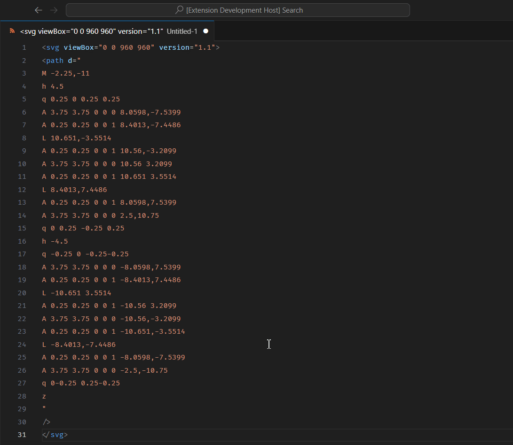

# SVGM

Lossless svg path minifier.

In more advanced scenarios, you might prefer to execute subtle optimizations, ensuring that the SVG path data remains intact without any alterations. And this is essentially what **SVGM** does.

## Feature 💭

- Minify consecutive commands
- Remove leading zeros in decimal digits ( 0.5xx → .5xx )
- Always using space as a separator. ( All commas "," will be replaced with spaces " ")
- Removing leading spaces if the next digit is negative. ( [0 -5] → [0-5] )
- Always converting the first "m" command to a capital "M"

## Usage 📖

- Block / select the Path
- [ Ctrl / Cmd ] + Shift + P
- Find : svgm
- Tap / Enter.
 
 

## Why SVGM 🤔

If you're looking for a tool to optimize your raw SVG files, consider [SVGO](https://github.com/svg/svgo#other-ways-to-use-svgo).

99.9% of the time, [SVGO](https://github.com/svg/svgo#other-ways-to-use-svgo) already solves nearly all optimization issues related to SVG files.

In fact, SVGM also borrows path minification algorithm utilized by [SVGO](https://github.com/svg/svgo#other-ways-to-use-svgo).

However, there are cases where optimizing by "rewriting" svg paths **can increase entropy in our code**. This increased entropy can cause our source code to become larger when compressed using methods like gzip or brotli.

## When to use 🤔

I will update a video, about it.

## Any Issues or Suggestions ?

Please post at : https://github.com/tian-xo/svgm

Or hit me up on : https://discordapp.com/users/tian#1279
